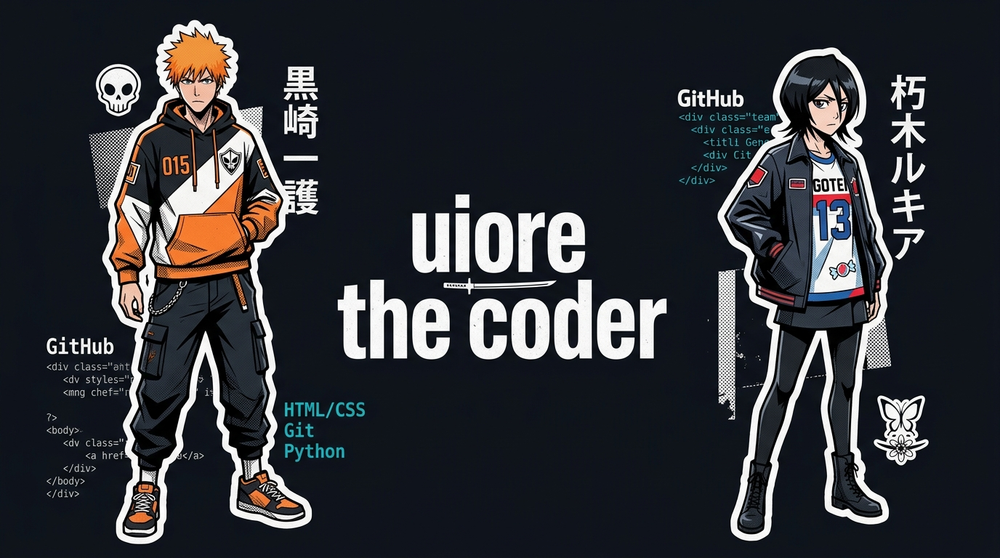

  

 

### about

software developer and systems builder. building client-side encryption tools, web applications, and developer utilities.

- github: [uioree](https://github.com/uioree)

---

### featured projects

| project | description | stack |
| :--- | :--- | :--- |
| **[Aura Vault](https://github.com/uioree/scripting)** | Zero-knowledge client-side encrypted password and secret vault | Python, FastAPI, Web Crypto API, SQLite |
| **[TOGU Diary](https://github.com/uioree/scripting)** | Offline-first student schedule and electronic diary application | JavaScript, PWA, Service Workers, CSS3 |
| **[Date Invitation](https://github.com/uioree/scripting)** | Interactive web application with custom animations | JavaScript, HTML5, CSS3 |

---

### tech stack

  

- **languages:** python, javascript, html5, css3, sql, shell / bash, batch
- **backend:** fastapi, rest apis, argon2id, web crypto api
- **databases:** sqlite, libsql / turso, postgresql
- **tools:** git, github actions, docker, linux, powershell

---

### activity

  

  
  

